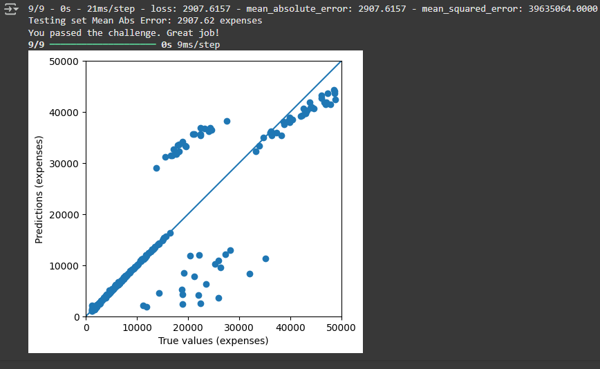

## Book Recommendation Algorithm

Este projeto foi desenvolvido como parte do currículo "Machine Learning with Python" da freeCodeCamp, com o objetivo de criar um algoritmo de recomendação de livros utilizando o modelo **K-Nearest Neighbors (K-NN)**. O modelo foi construído utilizando **Machine Learning** e a biblioteca **scikit-learn**.

O modelo foi treinado utilizando o conjunto de dados **Book-Crossings**, que contém 1.1 milhões de classificações (de 1 a 10) de 270.000 livros por 90.000 usuários. Após importar e limpar os dados, utilizei o algoritmo **NearestNeighbors** da biblioteca **sklearn.neighbors** para desenvolver um modelo que recomenda livros semelhantes a um livro fornecido como entrada.

A função **get_recommends** foi criada para retornar os 5 livros mais semelhantes com base na distância entre eles. Ao passar um título de livro como argumento, a função retorna uma lista com o livro e os 5 livros recomendados, juntamente com as distâncias de similaridade.

### Exemplo de execução:

A função **get_recommends("The Queen of the Damned (Vampire Chronicles (Paperback))")** retorna:

```python
[
  'The Queen of the Damned (Vampire Chronicles (Paperback))',
  [
    ['Catch 22', 0.793983519077301], 
    ['The Witching Hour (Lives of the Mayfair Witches)', 0.7448656558990479], 
    ['Interview with the Vampire', 0.7345068454742432],
    ['The Tale of the Body Thief (Vampire Chronicles (Paperback))', 0.5376338362693787],
    ['The Vampire Lestat (Vampire Chronicles, Book II)', 0.5178412199020386]
  ]
]
```

### Pré-processamento dos dados:
Para garantir uma análise significativa, foram removidos os usuários com menos de 200 avaliações e livros com menos de 100 avaliações.

## Resultado

No meu projeto, obtive um modelo funcional que recomenda livros semelhantes com base na distância de similaridade, criando uma experiência personalizada para os usuários.

## Referências

- [freeCodeCamp](https://github.com/freeCodeCamp)  
- [Mephistopheles-0](https://github.com/Mephistopheles-0)
